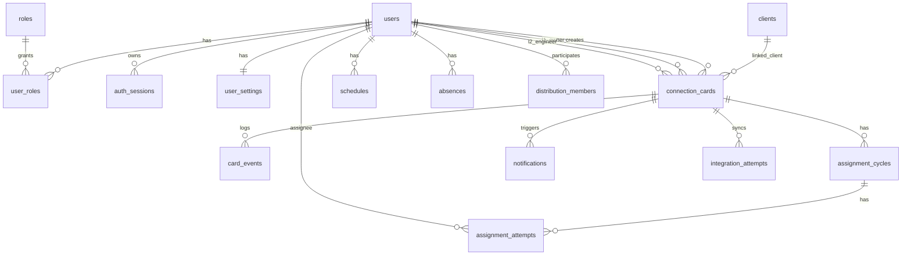

# Database Schema

## Remote Desktop Manager (RDM)

**Упрощённая структура PostgreSQL для MVP**

---

| Поле | Значение |
|---|---|
| Документ | Database Schema |
| Система | Remote Desktop Manager |
| Версия документа | 1.0 |
| Основание | RDM-SRS-v1.0, RDM-Technical-Design-v0.1, RDM-Database-Schema-v0.3, финальное согласование структуры справочников |
| Статус | Финальная версия схемы БД для первой миграции |
| Дата | 2026-09-01 |
| База данных | PostgreSQL |

---

## 1. Ключевые изменения относительно v0.2/v0.3

| Было ранее | Стало в v1.0 | Причина |
|---|---|---|
| `dict_values.id` как идентификатор значения | Убрано | Для справочников значение определяется парой `sysname + code` |
| `dict_values.code` строковый | `dict_values.code` числовой | В рабочих таблицах удобнее и быстрее хранить числовые коды |
| `dict_values.mnemonic` обсуждался как техническое имя | Убрано | Описание достаточно для чтения справочника, а технические enum-имена должны жить в коде |
| Даты в `dict_values` | Убраны | Для справочника MVP даты создания/обновления избыточны |
| Даты в `users` | Убраны | Изменения пользователей фиксируются через аудит |
| `roles.code` строковый | Убрано, роль определяется числовым `roles.id` | Роли — отдельный справочник с будущими правами |
| `user_settings.notification_preferences jsonb` | Заменено явными флагами | В сырых данных БД должно быть видно, какие уведомления включены |
| `outbox_events` | Убрано из MVP | Для первой версии достаточно `notifications` как очереди и `integration_attempts` как журнала |
| Порядок колонок в таблицах был смешанным | Колонки сгруппированы логически | По сырым данным должно быть понятно, что происходит с сущностью |

## 2. Общие принципы схемы

- RDM хранит собственные сущности: карточки подключений, пользователей, расписания, распределение, уведомления и историю.
- RDM не копирует тикеты Omnidesk в отдельную таблицу.
- В карточке хранится только номер тикета Omnidesk в формате `xxx-xxxxxx`.
- По одному тикету Omnidesk может быть несколько карточек за всю историю.
- Одновременно по одному тикету Omnidesk может быть только одна незавершённая карточка.
- Справочные значения хранятся в одной таблице `dict_values`.
- Ключ справочника: `sysname + code`.
- В рабочих таблицах хранятся числовые поля вида `status_code`, `result_code`, `contact_type_code`.
- Для чтения расшифровки используется соединение по `sysname` и `code`.
- Основные ID бизнес-таблиц — `bigint`.
- Для публичного API карточки используется `public_id uuid`, чтобы не раскрывать внутренний последовательный ID.

## 3. Принцип порядка колонок

Во всех таблицах колонки располагаются по одному принципу:

1. Идентификаторы.
2. Связи с другими сущностями.
3. Текущее состояние.
4. Время и интервалы.
5. Ответственные и участники процесса.
6. Основные данные и описание.
7. Результаты.
8. Технические поля, аудит и служебная информация.

Это не влияет на работу PostgreSQL, но делает сырые данные понятнее при ручной диагностике.

## 4. ER-схема MVP



## 5. Справочник фиксированных значений

### 5.1. `dict_values`

Единая таблица для статусов, типов контактов, срочности, критичности, результатов подключения, статусов уведомлений и других фиксированных значений.

| Поле | Тип | Обязательность | Примечание |
|---|---|---:|---|
| `sysname` | varchar(100) | PK, NOT NULL | Тип справочника: `card_status`, `contact_type`, `connection_result` |
| `code` | integer | PK, NOT NULL | Числовое значение внутри конкретного `sysname` |
| `description` | varchar(255) | NOT NULL | Отображаемое значение |
| `visible` | boolean | NOT NULL | Показывать в списках выбора |
| `sort_order` | integer | NOT NULL | Порядок отображения |

Ограничения:

```sql
primary key (sysname, code);
```

Принцип:

- `code = 0` может повторяться в разных справочниках;
- уникальным значением является не `code`, а пара `sysname + code`;
- в рабочих таблицах хранится только числовой код;
- при чтении расшифровки всегда указывается нужный `sysname`.

Пример соединения для статуса карточки:

```sql
select
  cc.number,
  cc.status_code,
  dv.description as status_name
from connection_cards cc
join dict_values dv
  on dv.sysname = 'card_status'
 and dv.code = cc.status_code;
```

### 5.2. Начальные значения `card_status`

| sysname | code | description | visible |
|---|---:|---|---:|
| `card_status` | 0 | Создано | true |
| `card_status` | 1 | Назначено | true |
| `card_status` | 2 | Подтверждено | true |
| `card_status` | 3 | Выполняется | true |
| `card_status` | 4 | Отклонено | true |
| `card_status` | 5 | Завершено | true |
| `card_status` | 6 | Отменено | true |

### 5.3. Начальные значения `connection_result`

| sysname | code | description | visible |
|---|---:|---|---:|
| `connection_result` | 0 | Завершено успешно | true |
| `connection_result` | 1 | Требуется повторное подключение | true |
| `connection_result` | 2 | Клиент не предоставил доступ | true |
| `connection_result` | 3 | Работы не завершены | true |

Список результатов должен редактироваться в админке.

### 5.4. Начальные значения `contact_type`

| sysname | code | description | visible |
|---|---:|---|---:|
| `contact_type` | 0 | Почта | true |
| `contact_type` | 1 | Телефон | true |
| `contact_type` | 2 | Telegram | true |

Почта считается приоритетным типом контакта, если она доступна из Omnidesk.

### 5.5. Основные `sysname`

| sysname | Назначение |
|---|---|
| `card_status` | Статус карточки |
| `connection_result` | Результат подключения |
| `contact_type` | Тип контакта клиента |
| `urgency` | Обычное или срочное подключение |
| `criticality` | Критичность карточки |
| `assignment_method` | Метод назначения |
| `created_source` | Источник создания |
| `timezone_source` | Источник часового пояса |
| `assignment_cycle_status` | Статус цикла распределения |
| `assignment_attempt_status` | Статус попытки назначения |
| `distribution_pool` | Пул распределения: L1 или L2 |
| `calendar_day_type` | Тип дня производственного календаря |
| `notification_channel` | Канал уведомления |
| `notification_event_type` | Тип события уведомления |
| `notification_status` | Статус уведомления |
| `integration_system` | Внешняя система |
| `integration_operation` | Операция интеграции |
| `integration_attempt_status` | Статус попытки интеграции |
| `actor_type` | Тип инициатора действия |
| `card_event_type` | Тип события карточки |
| `audit_action` | Тип действия аудита |

## 6. Пользователи и доступ

### 6.1. `users`

Пользователи RDM. Роли и участие в распределении хранятся отдельно.

| Поле | Тип | Обязательность | Примечание |
|---|---|---:|---|
| `id` | bigserial | PK | Внутренний ID пользователя |
| `username` | varchar(100) | UNIQUE, NOT NULL | Логин локального пользователя |
| `password_hash` | text | NOT NULL | Хэш пароля |
| `full_name` | varchar(255) | NOT NULL | ФИО |
| `email` | varchar(255) | NULL | Email сотрудника |
| `phone` | varchar(50) | NULL | Телефон сотрудника |
| `omnidesk_staff_id` | varchar(100) | UNIQUE, NULL | ID сотрудника Omnidesk |
| `is_active` | boolean | NOT NULL | Пользователь активен |

Даты создания и обновления не хранятся в этой таблице. Значимые изменения фиксируются в `audit_log`.

### 6.2. `roles`

Роли — отдельный справочник, потому что дальше у ролей могут появиться права, ограничения и настройки.

| Поле | Тип | Обязательность | Примечание |
|---|---|---:|---|
| `id` | smallint | PK | Числовой код роли |
| `name` | varchar(100) | NOT NULL | Отображаемое название |
| `description` | text | NULL | Описание |
| `visible` | boolean | NOT NULL | Показывать в интерфейсе |

Начальные роли:

| id | name | description |
|---:|---|---|
| 1 | Специалист Л1 | Первая линия, согласование времени с клиентом |
| 2 | Инженер Л2 | Выполнение удалённых подключений |
| 3 | Руководитель | Управление распределением и спорными ситуациями |
| 4 | Администратор | Настройка системы |

### 6.3. `user_roles`

Связь пользователей и ролей. Один пользователь может иметь несколько ролей, например L1 и L2.

| Поле | Тип | Обязательность | Примечание |
|---|---|---:|---|
| `user_id` | bigint | PK, FK | `users.id` |
| `role_id` | smallint | PK, FK | `roles.id` |

### 6.4. `auth_sessions`

Сессии внутренних пользователей RDM.

| Поле | Тип | Обязательность | Примечание |
|---|---|---:|---|
| `id` | bigserial | PK | ID сессии |
| `user_id` | bigint | FK, NOT NULL | Пользователь |
| `session_hash` | text | UNIQUE, NOT NULL | Хэш токена сессии |
| `created_at` | timestamptz | NOT NULL | Сессия создана |
| `expires_at` | timestamptz | NOT NULL | Сессия истекает |
| `last_seen_at` | timestamptz | NULL | Последняя активность |
| `revoked_at` | timestamptz | NULL | Сессия отозвана |

### 6.5. `user_settings`

Индивидуальные настройки пользователя без JSON для MVP.

| Поле | Тип | Обязательность | Примечание |
|---|---|---:|---|
| `user_id` | bigint | PK, FK | `users.id` |
| `timezone` | varchar(64) | NOT NULL | Часовой пояс интерфейса |
| `telegram_chat_id` | varchar(100) | NULL | Chat ID для Telegram-бота |
| `bitrix24_user_id` | varchar(100) | NULL | ID пользователя в Б24 |
| `notify_telegram` | boolean | NOT NULL | Уведомлять через Telegram |
| `notify_bitrix24` | boolean | NOT NULL | Уведомлять через Б24 |

Если позже появятся сложные настройки уведомлений по событиям, их лучше вынести в отдельную таблицу `user_notification_settings`, а не складывать в JSON.

## 7. Клиенты

### 7.1. `clients`

Минимальный кэш клиента Omnidesk. Это не копия клиентской базы Omnidesk, а локальная техническая сущность RDM.

Зачем нужна:

- уменьшить количество запросов к Omnidesk API;
- сохранить последний известный контакт клиента;
- сохранить последний подтверждённый часовой пояс;
- связать несколько карточек одного клиента между собой.

| Поле | Тип | Обязательность | Примечание |
|---|---|---:|---|
| `id` | bigserial | PK | Внутренний ID клиента |
| `omnidesk_user_id` | varchar(100) | UNIQUE, NULL | ID пользователя Omnidesk |
| `omnidesk_company_id` | varchar(100) | NULL | ID компании Omnidesk |
| `display_name` | varchar(255) | NULL | Имя клиента или компании |
| `preferred_contact_type_code` | integer | NULL | `dict_values`: `contact_type` |
| `preferred_contact_value` | varchar(255) | NULL | Email, телефон или Telegram |
| `last_confirmed_timezone` | varchar(64) | NULL | Последний подтверждённый часовой пояс |
| `timezone_source_code` | integer | NULL | `dict_values`: `timezone_source` |
| `last_synced_at` | timestamptz | NULL | Когда данные последний раз обновлялись из Omnidesk |

## 8. Карточки удалённого подключения

### 8.1. `connection_cards`

Основная таблица системы.

| Группа | Поле | Тип | Обязательность | Примечание |
|---|---|---|---:|---|
| Идентификаторы | `id` | bigserial | PK | Внутренний ID карточки |
| Идентификаторы | `public_id` | uuid | UNIQUE, NOT NULL | Публичный ID для API и ссылок |
| Идентификаторы | `number` | varchar(50) | UNIQUE, NOT NULL | Внутренний номер RDM |
| Omnidesk и клиент | `omnidesk_ticket_number` | varchar(20) | NOT NULL | Номер тикета Omnidesk формата `xxx-xxxxxx` |
| Omnidesk и клиент | `client_id` | bigint | FK, NULL | `clients.id` |
| Состояние | `status_code` | integer | NOT NULL | `dict_values`: `card_status` |
| Состояние | `criticality_code` | integer | NOT NULL | `dict_values`: `criticality` |
| Состояние | `urgency_code` | integer | NOT NULL | `dict_values`: `urgency` |
| Плановое время | `planned_start_at` | timestamptz | NOT NULL | Плановое начало |
| Плановое время | `planned_duration_minutes` | integer | NOT NULL | Плановая длительность, 30–720 минут |
| Плановое время | `client_timezone_at_creation` | varchar(64) | NULL | Часовой пояс клиента при создании |
| Плановое время | `timezone_source_code` | integer | NULL | `dict_values`: `timezone_source` |
| Фактическое время | `actual_start_at` | timestamptz | NULL | Фактическое начало |
| Фактическое время | `actual_end_at` | timestamptz | NULL | Фактическое окончание |
| Ответственные | `l1_owner_id` | bigint | FK, NULL | Сопровождающий Л1 |
| Ответственные | `l2_engineer_id` | bigint | FK, NULL | Ответственный Л2 |
| Назначение | `assignment_method_code` | integer | NOT NULL | `dict_values`: `assignment_method` |
| Назначение | `unsuccessful_cycle_count` | integer | NOT NULL | Количество неуспешных циклов распределения |
| Контакт клиента | `client_contact_type_code` | integer | NULL | `dict_values`: `contact_type` |
| Контакт клиента | `client_contact_value` | varchar(255) | NULL | Значение контакта |
| Описание | `description` | text | NULL | Описание задачи |
| Описание | `urgent_reason` | text | NULL | Основание срочности |
| Признаки | `out_of_hours_flag` | boolean | NOT NULL | Внерабочее подключение |
| Признаки | `retroactive_flag` | boolean | NOT NULL | Создано задним числом |
| Признаки | `overdue_flag` | boolean | NOT NULL | Просрочка реакции Л2 |
| Результат | `result_code` | integer | NULL | `dict_values`: `connection_result` |
| Результат | `engineer_report` | text | NULL | Перечень выполненных работ / комментарий инженера |
| Создание | `created_source_code` | integer | NOT NULL | `dict_values`: `created_source` |
| Создание | `created_by_id` | bigint | FK, NULL | Внутренний пользователь-создатель |
| Технические поля | `created_at` | timestamptz | NOT NULL | Дата создания карточки |
| Технические поля | `updated_at` | timestamptz | NOT NULL | Дата последнего изменения карточки |

### 8.2. Формирование `number`

`number` — внутренний номер карточки RDM, не связанный с номером Omnidesk.

Формат MVP:

```text
RDM-000001
RDM-000002
RDM-000003
```

Правило:

- PostgreSQL создаёт `id`;
- backend формирует `number = 'RDM-' + id с лидирующими нулями до 6 символов`;
- после `999999` номер продолжает расти без обрезания: `RDM-1000000`.

### 8.3. Плановое и фактическое время

Храним:

- `planned_start_at`;
- `planned_duration_minutes`;
- `actual_start_at`;
- `actual_end_at`.

Не храним:

- `planned_end_at`;
- `actual_duration_minutes`.

Они вычисляются:

```text
planned_end_at = planned_start_at + planned_duration_minutes
actual_duration = actual_end_at - actual_start_at
```

### 8.4. Ограничение активной карточки по тикету

По одному тикету Omnidesk может быть только одна активная карточка.

Активные статусы:

- `created`;
- `assigned`;
- `confirmed`;
- `in_progress`;
- `rejected`.

Завершённые статусы:

- `completed`;
- `cancelled`.

Ограничение MVP:

```sql
create unique index ux_connection_cards_one_active_per_ticket
on connection_cards (omnidesk_ticket_number)
where status_code not in (5, 6);
```

### 8.5. Ограничение пересечений по Л2

Отдельная таблица резервирования не нужна. Занятость инженера считается по активным карточкам.

```sql
create extension if not exists btree_gist;

alter table connection_cards
add constraint ex_connection_cards_l2_no_overlap
exclude using gist (
  l2_engineer_id with =,
  tstzrange(
    planned_start_at,
    planned_start_at + make_interval(mins => planned_duration_minutes),
    '[)'
  ) with &&
)
where (
  l2_engineer_id is not null
  and status_code in (1, 2, 3)
);
```

Для срочного подключения при коллизии система фиксирует событие, уведомляет руководителя и запускает переназначение.

## 9. История карточек

### 9.1. `card_events`

Журнал событий карточки. Нужен для разбора спорных ситуаций и восстановления истории.

| Поле | Тип | Обязательность | Примечание |
|---|---|---:|---|
| `id` | bigserial | PK | ID события |
| `card_id` | bigint | FK, NOT NULL | Карточка |
| `event_type_code` | integer | NOT NULL | `dict_values`: `card_event_type` |
| `actor_user_id` | bigint | FK, NULL | Внутренний пользователь |
| `actor_type_code` | integer | NOT NULL | `dict_values`: `actor_type` |
| `created_at` | timestamptz | NOT NULL | Дата события |
| `old_values` | jsonb | NULL | Старые значения |
| `new_values` | jsonb | NULL | Новые значения |
| `comment` | text | NULL | Комментарий |

JSON в `old_values` и `new_values` допустим, потому что это технический снимок изменений, а не рабочие поля для фильтрации.

## 10. Назначение и распределение Л2

Текущий назначенный инженер хранится в `connection_cards.l2_engineer_id`.

Таблицы `assignment_cycles` и `assignment_attempts` нужны не для текущего состояния, а для истории и логики автоматического распределения.

Они отвечают на вопросы:

- кому система уже предлагала карточку;
- кто подтвердил;
- кто отклонил;
- кто отклонил за инженера;
- почему карточка получила статус `Отклонено`;
- сколько кругов распределения было;
- нужно ли уведомить руководителя;
- почему выбран текущий Л2.

### 10.1. `assignment_cycles`

Один цикл — один круг распределения по доступным инженерам.

| Поле | Тип | Обязательность | Примечание |
|---|---|---:|---|
| `id` | bigserial | PK | ID цикла |
| `card_id` | bigint | FK, NOT NULL | Карточка |
| `cycle_number` | integer | NOT NULL | Номер цикла по карточке |
| `status_code` | integer | NOT NULL | `dict_values`: `assignment_cycle_status` |
| `started_at` | timestamptz | NOT NULL | Начало цикла |
| `completed_at` | timestamptz | NULL | Завершение цикла |

Примеры статусов цикла:

| sysname | code | description |
|---|---:|---|
| `assignment_cycle_status` | 0 | Идёт распределение |
| `assignment_cycle_status` | 1 | Инженер назначен |
| `assignment_cycle_status` | 2 | Все доступные инженеры отклонили |
| `assignment_cycle_status` | 3 | Цикл отменён |

### 10.2. `assignment_attempts`

Одна попытка — назначение или предложение карточки конкретному инженеру.

| Поле | Тип | Обязательность | Примечание |
|---|---|---:|---|
| `id` | bigserial | PK | ID попытки |
| `cycle_id` | bigint | FK, NOT NULL | Цикл распределения |
| `card_id` | bigint | FK, NOT NULL | Карточка |
| `l2_engineer_id` | bigint | FK, NOT NULL | Кандидат Л2 |
| `status_code` | integer | NOT NULL | `dict_values`: `assignment_attempt_status` |
| `assigned_at` | timestamptz | NOT NULL | Когда назначено/предложено |
| `responded_at` | timestamptz | NULL | Когда инженер ответил |
| `actor_user_id` | bigint | FK, NULL | Кто выполнил действие, если не сам Л2 |
| `rejection_reason` | text | NULL | Причина отказа |

Ограничение:

```sql
unique (cycle_id, l2_engineer_id)
```

Пример:

| card_id | cycle_number | l2_engineer_id | status_code | meaning |
|---:|---:|---:|---:|---|
| 15 | 1 | 7 | 2 | Отклонил |
| 15 | 1 | 12 | 2 | Отклонил |
| 15 | 1 | 18 | 2 | Отклонил |

После отказа всех доступных Л2 карточка получает `status_code = 4` (`Отклонено`), Л1 получает задачу согласовать новое время, руководитель получает уведомление.

## 11. Расписание и доступность

### 11.1. `schedules`

Расписание хранит только рабочие интервалы. Выходной — это отсутствие рабочего интервала.

| Поле | Тип | Обязательность | Примечание |
|---|---|---:|---|
| `id` | bigserial | PK | ID интервала |
| `user_id` | bigint | FK, NOT NULL | Пользователь |
| `weekday` | smallint | NOT NULL | 1–7, где 1 — понедельник |
| `start_time` | time | NOT NULL | Начало рабочего интервала |
| `end_time` | time | NOT NULL | Конец рабочего интервала |
| `timezone` | varchar(64) | NOT NULL | Часовой пояс графика |
| `is_active` | boolean | NOT NULL | Интервал активен |
| `valid_from` | date | NULL | Начало действия расписания |
| `valid_to` | date | NULL | Окончание действия расписания |

Примеры:

- ПН–ПТ: строки есть только на `weekday = 1..5`.
- Выходные СР–ЧТ: строк на `weekday = 3` и `weekday = 4` нет.
- Две смены в день: две строки на один `weekday`.

### 11.2. `absences`

Отсутствия сотрудников: отпуск, больничный, обучение, временная недоступность.

| Поле | Тип | Обязательность | Примечание |
|---|---|---:|---|
| `id` | bigserial | PK | ID отсутствия |
| `user_id` | bigint | FK, NOT NULL | Пользователь |
| `start_at` | timestamptz | NOT NULL | Начало отсутствия |
| `end_at` | timestamptz | NOT NULL | Конец отсутствия |
| `created_by_id` | bigint | FK, NULL | Кто создал |
| `created_at` | timestamptz | NOT NULL | Когда создано |
| `reason` | varchar(255) | NULL | Причина |

### 11.3. `production_calendar_days`

Производственный календарь РФ с возможностью ручной корректировки.

| Поле | Тип | Обязательность | Примечание |
|---|---|---:|---|
| `date` | date | PK | День |
| `day_type_code` | integer | NOT NULL | `dict_values`: `calendar_day_type` |
| `is_manual_override` | boolean | NOT NULL | Ручная корректировка |
| `updated_by_id` | bigint | FK, NULL | Кто изменил |
| `updated_at` | timestamptz | NOT NULL | Когда изменил |
| `comment` | text | NULL | Комментарий |

## 12. Участие в распределении

### 12.1. `distribution_members`

Участие в распределении оставляется отдельной таблицей, а не полем в `users`.

Причины:

- один пользователь может быть одновременно Л1 и Л2;
- участие в распределении Л1 и Л2 включается независимо;
- пользователь может иметь роль Л2, но временно не участвовать в распределении;
- включение/исключение из распределения выполняется только по решению руководителя;
- нужна история, кто и когда включил или исключил сотрудника.

| Поле | Тип | Обязательность | Примечание |
|---|---|---:|---|
| `id` | bigserial | PK | ID записи |
| `user_id` | bigint | FK, NOT NULL | Пользователь |
| `pool_code` | integer | NOT NULL | `dict_values`: `distribution_pool` |
| `is_enabled` | boolean | NOT NULL | Участвует в распределении |
| `enabled_by_id` | bigint | FK, NULL | Кто включил |
| `enabled_at` | timestamptz | NULL | Когда включил |
| `disabled_by_id` | bigint | FK, NULL | Кто исключил |
| `disabled_at` | timestamptz | NULL | Когда исключил |
| `comment` | text | NULL | Основание |

Ограничение:

```sql
unique (user_id, pool_code)
```

### 12.2. `distribution_state`

Хранит позицию Round Robin по каждому пулу распределения.

| Поле | Тип | Обязательность | Примечание |
|---|---|---:|---|
| `pool_code` | integer | PK | `dict_values`: `distribution_pool` |
| `last_user_id` | bigint | FK, NULL | Последний выбранный пользователь |
| `updated_at` | timestamptz | NOT NULL | Когда обновлено |

## 13. Уведомления и интеграции

В MVP оставляем три таблицы:

1. `notification_templates` — шаблоны сообщений.
2. `notifications` — очередь и история отправки уведомлений.
3. `integration_attempts` — журнал вызовов внешних API.

`outbox_events` в MVP не используется.

### 13.1. Зачем нужна `notification_templates`

Эта таблица нужна, чтобы тексты не были зашиты в код.

Примеры шаблонов:

- уведомление Л2 о назначении;
- напоминание Л2 каждые 10 минут;
- уведомление руководителя при первом круге отказов;
- уведомление Л1 о необходимости связаться с клиентом;
- сообщение клиенту в Omnidesk за 15 минут до подтверждённого подключения.

### 13.2. `notification_templates`

| Поле | Тип | Обязательность | Примечание |
|---|---|---:|---|
| `id` | bigserial | PK | ID шаблона |
| `code` | varchar(100) | UNIQUE, NOT NULL | Код шаблона |
| `channel_code` | integer | NOT NULL | `dict_values`: `notification_channel` |
| `visible` | boolean | NOT NULL | Показывать в админке |
| `subject_template` | text | NULL | Заголовок |
| `body_template` | text | NOT NULL | Тело сообщения |

### 13.3. Зачем нужна `notifications`

Эта таблица одновременно очередь и журнал уведомлений.

Она нужна, чтобы:

- видеть, какие уведомления должны быть отправлены;
- отправлять отложенные уведомления;
- повторять отправку при ошибке;
- видеть, кому и когда сообщение ушло;
- видеть ошибку, если сообщение не ушло.

### 13.4. `notifications`

| Поле | Тип | Обязательность | Примечание |
|---|---|---:|---|
| `id` | bigserial | PK | ID уведомления |
| `card_id` | bigint | FK, NULL | Карточка, если уведомление связано с карточкой |
| `recipient_user_id` | bigint | FK, NULL | Внутренний получатель |
| `channel_code` | integer | NOT NULL | `dict_values`: `notification_channel` |
| `event_type_code` | integer | NOT NULL | `dict_values`: `notification_event_type` |
| `status_code` | integer | NOT NULL | `dict_values`: `notification_status` |
| `scheduled_at` | timestamptz | NULL | Когда надо отправить |
| `sent_at` | timestamptz | NULL | Когда отправлено |
| `created_at` | timestamptz | NOT NULL | Когда создано |
| `payload` | jsonb | NOT NULL | Снимок данных для отправки без секретов |
| `error_message` | text | NULL | Ошибка отправки |

`payload jsonb` здесь допустим, потому что разные каналы имеют разные форматы сообщения. Это не основная бизнес-информация, а технический снимок конкретной отправки.

### 13.5. Зачем нужна `integration_attempts`

Эта таблица фиксирует попытки обращения к внешним системам.

Она нужна, чтобы диагностировать:

- почему не добавилась заметка в Omnidesk;
- почему не сменился ответственный в Omnidesk;
- почему не перевёлся статус тикета из закрытого в открытое;
- почему не ушло сообщение клиенту;
- почему Telegram или Б24 вернули ошибку.

### 13.6. `integration_attempts`

| Поле | Тип | Обязательность | Примечание |
|---|---|---:|---|
| `id` | bigserial | PK | ID попытки |
| `card_id` | bigint | FK, NULL | Карточка, если операция связана с карточкой |
| `system_code` | integer | NOT NULL | `dict_values`: `integration_system` |
| `operation_code` | integer | NOT NULL | `dict_values`: `integration_operation` |
| `status_code` | integer | NOT NULL | `dict_values`: `integration_attempt_status` |
| `created_at` | timestamptz | NOT NULL | Когда выполнена попытка |
| `request_meta` | jsonb | NULL | Метаданные запроса без секретов |
| `response_meta` | jsonb | NULL | Метаданные ответа без персональных данных |
| `error_message` | text | NULL | Ошибка |

JSON в `request_meta` и `response_meta` допустим, потому что это диагностические поля, а не данные для регулярной фильтрации.

## 14. Аудит и настройки системы

### 14.1. `audit_log`

Общий журнал значимых действий.

| Поле | Тип | Обязательность | Примечание |
|---|---|---:|---|
| `id` | bigserial | PK | ID записи |
| `actor_user_id` | bigint | FK, NULL | Внутренний пользователь |
| `actor_type_code` | integer | NOT NULL | `dict_values`: `actor_type` |
| `action_code` | integer | NOT NULL | `dict_values`: `audit_action` |
| `entity_type` | varchar(100) | NOT NULL | Тип сущности |
| `entity_id` | bigint | NULL | ID сущности |
| `created_at` | timestamptz | NOT NULL | Дата действия |
| `ip_address` | inet | NULL | IP |
| `user_agent` | text | NULL | User-Agent |
| `old_values` | jsonb | NULL | Старые значения |
| `new_values` | jsonb | NULL | Новые значения |

### 14.2. `system_settings`

Глобальные настройки системы.

| Поле | Тип | Обязательность | Примечание |
|---|---|---:|---|
| `key` | varchar(100) | PK | Ключ настройки |
| `value` | jsonb | NOT NULL | Значение |
| `updated_by_id` | bigint | FK, NULL | Кто изменил |
| `updated_at` | timestamptz | NOT NULL | Когда изменено |
| `description` | text | NULL | Описание |

JSON здесь допустим, потому что настройки могут быть разного типа: число, строка, объект, список. Если какая-то настройка станет часто фильтруемой, её можно вынести в отдельную колонку или таблицу.

## 15. Клиентский фрейм и Redis

Сессии клиентского фрейма не хранятся в PostgreSQL.

Вариант Redis-ключа:

```text
frame_session:{token_hash}
```

Пример значения:

```json
{
  "omnidesk_ticket_number": "829-447027",
  "created_at": "2026-09-01T12:00:00Z",
  "expires_at": "2026-09-01T12:15:00Z",
  "origin": "https://iridi.omnidesk.ru",
  "permissions": ["cards:read", "cards:create"]
}
```

TTL: 15–30 минут.

В PostgreSQL фиксируются только значимые действия, например создание карточки через фрейм.

## 16. Индексы и ограничения

| Таблица | Индекс / ограничение | Назначение |
|---|---|---|
| `dict_values` | PK `(sysname, code)` | Уникальность значения внутри справочника |
| `users` | unique `username` | Уникальный логин |
| `users` | unique `omnidesk_staff_id` where not null | Связь с сотрудником Omnidesk |
| `clients` | unique `omnidesk_user_id` where not null | Кэш клиента Omnidesk |
| `connection_cards` | unique `public_id` | Безопасный публичный ID |
| `connection_cards` | unique `number` | Уникальный номер карточки RDM |
| `connection_cards` | index `omnidesk_ticket_number` | Быстро показать карточки по тикету |
| `connection_cards` | partial unique active card per ticket | Запрет второй активной карточки по тикету |
| `connection_cards` | index `status_code, planned_start_at` | Списки и фоновые проверки |
| `connection_cards` | index `l2_engineer_id, planned_start_at` | Календарь и проверка Л2 |
| `connection_cards` | exclusion constraint by L2 and planned range | Запрет пересечения активных карточек Л2 |
| `assignment_cycles` | unique `(card_id, cycle_number)` | Один номер цикла внутри карточки |
| `assignment_attempts` | unique `(cycle_id, l2_engineer_id)` | Один Л2 один раз в цикле |
| `schedules` | index `(user_id, weekday)` | Поиск графика |
| `distribution_members` | unique `(user_id, pool_code)` | Один участник один раз в пуле |
| `notifications` | index `(status_code, scheduled_at)` | Очередь уведомлений |
| `integration_attempts` | index `(system_code, operation_code, created_at)` | Диагностика интеграций |
| `audit_log` | index `(entity_type, entity_id, created_at)` | История сущности |

## 17. Минимальный состав первой миграции

В первую миграцию MVP входят:

1. `dict_values`
2. `users`
3. `roles`
4. `user_roles`
5. `auth_sessions`
6. `user_settings`
7. `clients`
8. `connection_cards`
9. `card_events`
10. `assignment_cycles`
11. `assignment_attempts`
12. `schedules`
13. `absences`
14. `production_calendar_days`
15. `distribution_members`
16. `distribution_state`
17. `notification_templates`
18. `notifications`
19. `integration_attempts`
20. `audit_log`
21. `system_settings`

Не входят в MVP:

- `omnidesk_tickets`;
- PostgreSQL-таблица `frame_sessions`;
- `engineer_reservations`;
- `outbox_events`;
- отдельная таблица `connection_results`.

## 18. Что важно учесть при реализации миграции

### 18.1. Связи со справочником

В рабочих таблицах хранятся числовые коды:

```text
status_code
result_code
contact_type_code
urgency_code
criticality_code
```

Расшифровка всегда выполняется через конкретный `sysname`:

```sql
join dict_values dv
  on dv.sysname = 'card_status'
 and dv.code = connection_cards.status_code
```

Если потребуется строгий FK на справочник, возможны два варианта:

1. добавить в таблицы технические generated-колонки с фиксированным `sysname`;
2. проверять допустимость кодов на уровне backend и seed-миграций.

Для MVP выбран второй вариант: он проще и сохраняет таблицы читаемыми.

### 18.2. JSON-поля

JSON не используется для основных бизнес-данных и настроек пользователя.

JSON оставлен только там, где структура данных техническая и может отличаться:

- снимки изменений в `card_events`;
- payload отправки в `notifications`;
- request/response meta в `integration_attempts`;
- значение произвольной системной настройки в `system_settings`.

### 18.3. Читаемость сырых данных

Основные рабочие таблицы должны быть понятны без сложной реконструкции:

- в карточке рядом стоят плановое и фактическое время;
- рядом стоят Л1, Л2 и метод назначения;
- контакт клиента сгруппирован отдельно;
- результат и отчёт инженера находятся в конце карточки;
- технические поля не перемешаны с бизнес-полями.
