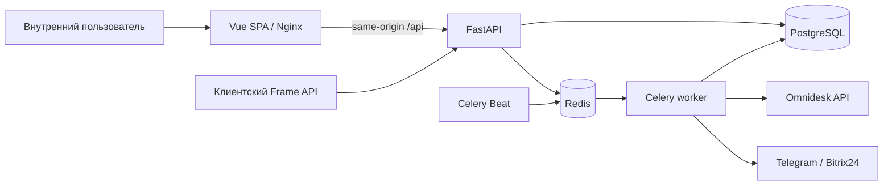

# Technical Design — Remote Desktop Manager (RDM)

| Поле | Значение |
|---|---|
| Версия документа | 1.0 |
| Дата | 24 сентября 2026 г. |
| Статус | Основная техническая редакция по текущему коду; открытые дефекты и эксплуатационные gates указаны явно |
| Базовый код | `main` / `origin/main` на `7124301c1ab5721604af434cf518e4d990719dc3` |
| Основание | `RDM-Concept.md`, `RDM-SRS.md`, `RDM-ROADMAP.md`, `decisions/` |
| Предыдущая редакция | `RDM-Technical-Design-v0.1.md` от 31 августа 2026 г. |
| Граница подтверждения | Описаны исходники и опубликованные результаты изолированных проверок. Текущее состояние stage и production не проверялось. |

## История редакций

| Версия | Изменение |
|---|---|
| 0.1 | Исходный проект архитектуры до прикладной реализации. Сохранён без переписывания как историческая редакция. |
| 1.0 | Сверены реальные компоненты, API, схема, миграции, очереди, Omnidesk, безопасность, тестовый gate и незавершённые направления. |

## Как читать статусы

**Реализовано в Git** означает наличие кода на указанном baseline. **Проверено** означает конкретный опубликованный тест или gate. **Запланировано** означает требование либо проектное намерение без завершённой реализации. **Требует исправления** означает расхождение, найденное при сверке кода с контрактом. Эти состояния не заменяют друг друга. Версия документа 1.0 не означает production-ready.

# 1. Назначение документа

Документ описывает техническое устройство RDM на текущем Git baseline и границы его развития. Он нужен для проектирования изменений, независимой проверки и подготовки отдельного stage/production gate. Нормативное поведение задают Concept, SRS и принятые решения; при конфликте реализации с требованием здесь указан наблюдаемый код и открытое действие.

RDM владеет карточкой удалённого подключения, назначениями L1/L2, временем, состояниями, историей и уведомлениями. Omnidesk остаётся системой обращений. Входящие webhooks и события Omnidesk исключены из продукта; исходящие записи выполняются через отдельный durable outbox.

# 2. Архитектурный подход

## 2.1. Текущий контур

FastAPI, frontend, worker и beat запускаются как отдельные Compose-сервисы. Приложение остаётся модульным монолитом: изменение карточки, событие, аудит и намерение внешней доставки фиксируются внутри PostgreSQL-транзакции; внешний вызов выполняется позже. Redis обслуживает Celery и короткие frame-сессии, но не заменяет PostgreSQL как источник бизнес-состояния.

## 2.2. Границы доверия и отказов

Браузер не выбирает внутренние идентификаторы Omnidesk для manager-контуров. Backend разрешает `case_number` через внутренний индекс и повторно сверяет ответ живого Omnidesk перед созданием карточки. Клиентский Frame API использует отдельный контракт: пара `case_id` из контекста страницы и номера обращения является недоверенным вводом и проверяется сервером через Omnidesk. Ошибка внешней доставки не откатывает уже сохранённую карточку. Корректность очереди проверяется отдельно от доступности внешнего API.

# 3. Компоненты системы

| Компонент | Реализация на baseline | Состояние |
|---|---|---|
| Backend API | FastAPI в `backend/app/`, Pydantic схемы | Реализовано |
| Репозитории данных | Прямой `psycopg` и SQL в модулях домена; Alembic использует SQLAlchemy для миграций | Реализовано |
| Internal UI | Один Vue 3 SPA, Vite build, Nginx SPA fallback и прокси `/api/` | Частично: нет полного рабочего места каждой роли |
| Client Frame UI | Backend Frame API реализован; отдельного клиентского UI в `frontend/src/` нет | Запланировано |
| PostgreSQL | Карточки, участники, аудит, уведомления, Omnidesk index/outbox | Реализовано в миграциях до `20260924_0012` |
| Redis | Broker/result backend Celery и frame-session TTL | Реализовано |
| Worker и Beat | Celery задачи уведомлений, напоминаний, автопродления, Omnidesk outbox | Реализовано; конфигурация очереди автопродления требует исправления (§19) |
| Внешние системы | Omnidesk, Telegram, Bitrix24 adapters | Изолированные и исторические stage-проверки; текущая внешняя доставка не проверялась |
| Мониторинг и backup | Health API есть; versioned production-контур метрик, backup/restore не завершён | Запланировано |

# 4. Backend

## 4.1. Стек и организация

Backend использует Python, FastAPI, Pydantic, `psycopg`, Alembic, Celery и pytest. SQLAlchemy указан в зависимостях ради Alembic и миграций; прикладные репозитории открывают `psycopg.Connection` через `app.db.db_connection`, а не ORM-сессию.

- `api/` — HTTP-маршруты auth, cards, frame, manager и health.
- `cards/` — состояние, создание по ролям, policy, транзакционные операции и автопродление.
- `assignments/` — L1/L2 Round Robin, попытки назначения и эскалация руководителю.
- `frame/` — проверка Omnidesk и Redis frame-session.
- `omnidesk_index/` — внутренний индекс, resolver и ручной backfill.
- `integrations/omnidesk_outbox.py` — исходящая запись в Omnidesk.
- `notifications.py`, `reminders.py`, `worker.py` — intents, доставка и расписания.
- `auth/`, `admin/`, `core/` — пользователи, настройки и конфигурация.

## 4.2. Транзакционный принцип

Сервис проверяет роль, владение и допустимое состояние до записи. Изменение карточки, `card_events`, аудит, назначения, reminder schedules и создаваемые intents должны фиксироваться согласованно. PostgreSQL ограничения защищают от второй активной карточки на одно обращение, пересекающихся активных интервалов L2 и более одной карточки `IN_PROGRESS` на L2. Блокировки строк и уникальные ключи поддерживают конкурентные сценарии; внешние HTTP-вызовы не выполняются внутри транзакции изменения карточки.

# 5. Frontend

Один Vue SPA в `frontend/src/App.vue` обеспечивает login/logout, открытие карточки по `/cards/{public_id}`, безопасную историю, доступные действия назначенных ролей, панель `/manager`, список/календарь день–неделя и `/manager/cards/new`. Nginx отдаёт build со SPA fallback и проксирует `/api/` к backend по внутренней сети Compose. Форма руководителя использует только `case_number`; адрес backend не встраивается в браузерный код.

Текущие тесты включают native frontend suite и компонентные тесты, но полноценные browser E2E по ролям, двойной отправке формы, часовым поясам и клиентскому фрейму остаются в FE-01..03. Pinia, Vue Router и отдельная UI-библиотека из проекта v0.1 не являются необходимыми установленными компонентами текущего SPA.

# 6. Клиентский фрейм Omnidesk

Backend-контур `/api/v1/frame` реализует `POST /sessions`, `GET /cards` и `POST /cards`. Создание session требует `case_id` и номер обращения как недоверенную пару; backend получает тикет по `case_id`, сверяет номер, клиентский контекст, удаление/спам и состояние. При допустимом создании из закрытого обращения сервер переоткрывает тикет и повторно подтверждает ответ. Session хранится в Redis по хэшу токена с TTL (на baseline настройка 15 минут), передаётся в `X-RDM-Frame-Token`, связывается с тикетом и Origin/Referer при наличии.

Frame API отдаёт только ограниченную проекцию карточек текущего обращения и разрешает создание; перенос и отмена клиенту не предоставляются. Браузерный Frame UI ещё не реализован. Успешная проверка backend API не равна готовому клиентскому фрейму. Остаточный риск ограниченной модели доверия к контексту страницы Omnidesk остаётся предметом отдельного security/stage gate.

# 7. Модель данных

## 7.1. Ключевые группы таблиц

| Область | Таблицы и назначение |
|---|---|
| Доступ | `users`, `roles`, `user_roles`, `auth_sessions`, `user_settings` |
| Карточка | `connection_cards`, `card_events`, `audit_log`, `clients` |
| Назначение и время | `assignment_cycles`, `assignment_attempts`, `distribution_members`, `distribution_state`, `schedules`, `absences`, `production_calendar_days`, `reminder_schedules`, `session_extensions` |
| Уведомления | `notification_templates`, `notifications`, `integration_attempts` |
| Omnidesk | `omnidesk_case_index`, `omnidesk_case_index_sync_state`, `omnidesk_case_index_conflicts`, `omnidesk_outbox` |
| Настройки и результаты | `system_settings`, `connection_results`, `dict_values` |

Текущий head исходников — `20260924_0012`. Миграция `0001` создала базовую схему; `0005` добавила расписания напоминаний; `0006` — индекс Omnidesk и checkpoint/conflict ledger; `0007` — административные данные и расширения; `0008`–`0012` — Omnidesk outbox, ограничения продления и события IE-01. `Docs/RDM-Database-Schema.md` описывает первую схему, а текущее физическое состояние следует проверять по Alembic и самой PostgreSQL. Head действующего stage не измерялся в этой редакции.

## 7.2. Идентификаторы и ограничения

Внутренние ключи основных записей — числовые. `connection_cards.public_id` — UUID для ссылок и внутреннего API, `number` — человекочитаемый `RDM-...`, `omnidesk_ticket_number` — публичный номер обращения. Внутренний `case_id` хранится в Omnidesk index и не должен выходить в manager browser/API.

- Частичный unique index ограничивает одну активную карточку на номер обращения.
- PostgreSQL exclusion constraint запрещает пересечение интервалов одного L2 в активных статусах.
- Частичный unique index `ix_one_in_progress_per_l2` ограничивает один `IN_PROGRESS` на L2.
- Reminder schedules хранят snapshot интервалов/порогов и закрываются при смене соответствующего lifecycle.
- Дедупликация notification intents и Omnidesk outbox опирается на исходные события и уникальные ключи.

`planned_end_at` вычисляется из начала и длительности; фактическое начало/окончание сохраняются отдельно. Состояния и коды справочников определяются миграциями и `cards/constants.py`; текущая таблица не повторяет историческую UUID-схему из v0.1.

# 8. API-контракт

## 8.1. Действующие группы

| Контур | Действующие маршруты и границы |
|---|---|
| Health | `GET /health/live`, `GET /health/ready`; readiness проверяет PostgreSQL и Redis. `/metrics` в коде нет. |
| Auth | `POST /api/v1/auth/login`, `POST /logout`, `GET /me`; локальная cookie-session. |
| Cards | `/api/v1/cards/l1`, `/l2`, `/l2/urgent`, `/l2/retroactive`; `GET /{card_id}`, `GET /{card_id}/history`, действия assign/confirm/reject/start/end-pending-result/complete/cancel и L1 client-informed/reschedule. Generic `POST /api/v1/cards` удалён. |
| Manager | `/api/v1/manager/tickets/{case_number}/preflight`, `/l2-options`, `/cards` create/list; admin settings для interval автопродления и публичного уведомления. |
| Frame | `POST /api/v1/frame/sessions`, `GET /cards`, `POST /cards`; token ограничен тикетом. |

Полные поля и ошибки берутся из OpenAPI конкретного commit и Pydantic-схем, а не из примерных URI v0.1. Для state-changing маршрутов policy различает отсутствие права и недопустимое состояние (`403`/`409`); валидация формы даёт `422`. Выдача manager API ограничена safe projection и диапазоном `limit` 1–200.

## 8.2. Запланированные API

Клиентский Frame UI, полноценные административные интерфейсы, отчёты и отдельный integration E2E остаются в roadmap. Входящий Omnidesk webhook/API не планируется в рамках продукта.

# 9. Фоновые задачи и очереди

## 9.1. Действующие задачи

`app.worker` определяет доставку Telegram/Bitrix24 notification intents, scan reminders, автопродление сессий и доставку `omnidesk_outbox`. Beat добавляет notification delivery и scanner только при соответствующих настройках; автопродление и Omnidesk outbox добавлены в расписание без этих двух флагов. Из `.env.example` следует лишь шаблон `NOTIFICATION_DELIVERY_ENABLED=false` и `REMINDER_SCANNER_ENABLED=false`, а не состояние действующего стенда.

## 9.2. Конкуренция, повторы и границы гарантии

Notification runtime и Omnidesk outbox выбирают due intents из PostgreSQL с `FOR UPDATE SKIP LOCKED`, ограничивают попытки и восстанавливают устаревшие lock. Создание intent и бизнес-событие связаны транзакционно; внешняя доставка выполняется после commit. Это at-least-once контур: сбой между успешным HTTP-вызовом и записью `sent` может дать повтор, поэтому важны дедупликация и адаптерные контракты. Ошибка внешней системы классифицируется отдельно от состояния карточки.

## 9.3. Требующая исправления конфигурация

В versioned Compose worker запускается с `--queues=notifications`, а `extend_sessions` направлен в `scheduler`. В этой конфигурации нет worker, подписанного на `scheduler`; одного расписания Beat недостаточно для выполнения автопродления. Перед stage-acceptance BL-04 требуется согласовать маршрутизацию и подтвердить выполнение реальной scheduled task. См. §19.

# 10. Интеграция с Omnidesk

## 10.1. Чтение и разрешение обращения

Manager принимает `case_number`, разрешает внутренний ID через `omnidesk_case_index`, обрабатывает отсутствие и неоднозначность безопасными ошибками, затем читает тикет из Omnidesk и повторно сверяет номер/клиента. Ручной backfill индекса имеет checkpoint/conflict ledger и запускается явным CLI; наличие миграции и resolver в Git не доказывает полноту или свежесть индекса действующего стенда. Frame API использует отдельную проверку пары из контекста Omnidesk.

## 10.2. Исходящие действия

В `omnidesk_outbox` пишутся intent для назначения L1/L2, внутренней заметки и публичного сообщения за 15 минут. Worker повторно разрешает тикет перед записью. Для назначения нужен `omnidesk_staff_id`; отсутствие mapping даёт постоянную ошибку `external-sync` и notification intents администратору/руководителю без отката карточки. Для публичного сообщения предусмотрены шаблон, административный флаг, время `planned_start_at − 15 минут` и подавление устаревшего intent после переноса/отмены.

Кодовый gate IE-01 на `f5398a2` прошёл, включая отдельную PostgreSQL matrix 8 passed. Реальные внешние записи Omnidesk в этом gate не выполнялись. Проверка статуса для публичного сообщения требует исправления: код использует `status_code=1`, а enum определяет `CONFIRMED=2`; см. §19. Поэтому работающий 15-минутный сценарий для подтверждённой карточки здесь не заявляется.

## 10.3. Исключённые взаимодействия

RDM не принимает входящие Omnidesk webhooks/events, не закрывает тикет при завершении карточки и не меняет группу Omnidesk. Точный внешний контракт записи и обработку rate/retry проверять по `frame/omnidesk.py`, `integrations/omnidesk_outbox.py` и профильным тестам; не выводить поддержку внешнего сценария из одной таблицы или intent.

# 11. Уведомления и напоминания

Внутренние Telegram/Bitrix24 уведомления сохраняются в `notifications` с source event, dedupe key, получателем, каналом и состоянием доставки. Адаптеры используют настройки пользователя и безопасную ссылку на карточку; worker учитывает retry, stale locks и ошибки внешней системы. Отдельный Omnidesk outbox не является общей таблицей `outbox_events` из v0.1.

Reminder schedules для L2 и L1 используют серверные якоря, snapshot настроек и catch-up без создания пропущенной лавины событий. Таймерное напоминание само не меняет статус карточки. Полные правила L1 до/после информирования и manager escalation находятся в `decisions/05-timer-reminders-and-escalations.md`. IE-02 ещё не закрывает полную матрицу событие × получатель × канал × повтор × выключенный runtime; старые stage-проверки не заменяют новый gate.

# 12. Авторизация и безопасность

Пароли внутренних пользователей хэшируются Argon2id. Session token создаётся случайным, хранится как HMAC-хэш в `auth_sessions`, передаётся в HttpOnly cookie с TTL; `Secure` обязателен для HTTPS, а `false` допускается только для доверенного HTTP LAN stage. Роли L1/L2/руководителя и администратора независимы. `CardAction` policy проверяет роль, фактическое владение карточкой и статус до изменения; история и аудит сохраняют actor.

Manager browser/API принимает публичный номер тикета и UUID карточки; внутренний Omnidesk ID не должен появляться в request/response/URL/DOM/ошибках и manager-логах. Frame API — отдельная ограниченная trust-модель с серверной проверкой недоверенной пары. FastAPI validation handler не возвращает отвергнутое входное значение `case_id`. Секреты не помещаются в Git, логи, документы или уведомления. Production-хранилище секретов и полноценный security gate остаются открытыми.

# 13. Время и часовые пояса

Моменты времени сохраняются как `timestamptz`; сравнение и фоновые расчёты выполняются относительно UTC. API создания требует timezone-aware `planned_start_at`; длительность обычной карточки — 30–720 минут, расчётные границы планирования определяются ролью и сценарием. Внутренний UI отображает локальное время браузера; manager date-only фильтр переводит местные границы суток в UTC. Frame API сохраняет часовой пояс клиента при создании; отдельного UI для выбора часового пояса клиента пока нет. Часовой пояс планировщика Celery задан как `Europe/Moscow` при `enable_utc=true`.

# 14. Деплой и окружения

## 14.1. Versioned Compose

`docker-compose.yml` содержит `postgres` (PostgreSQL 16), `redis` (Redis 7), `backend`, `worker`, `beat`, `frontend`. Frontend Nginx проксирует `/api/` в backend и обслуживает SPA; текущий Compose сам не добавляет TLS proxy, Prometheus или Grafana из исходного проекта v0.1. Конфигурация сервисов читается из локального `.env`; `.env.example` используется как шаблон и в изолированном quality gate.

## 14.2. Доставка

Публикация commit, preflight стенда, backup, миграция, запуск контейнеров, smoke и rollback — отдельные этапы. `alembic head` в исходниках равен `20260924_0012`, фактический head stage не измерялся при этой редакции. Исторические проверки stage сохранены в `RDM-Stage-History.md`; они не подтверждают текущий runtime. Перед включением фоновых задач требуются проверки очередей и внешних получателей.

# 15. Backup и восстановление

PostgreSQL хранит бизнес-данные и историю; Redis содержит короткие frame-сессии и брокерный контур. Для production нужны versioned расписание backup, хранение вне контейнера, политика retention и проверяемое восстановление. На текущем baseline это не закрытый OP-01 gate. Перед миграцией существующей stage-БД требуется отдельный backup/preflight; успешный локальный migration round-trip не является проверкой её восстановления.

# 16. Мониторинг и диагностика

Реализованы `/health/live` и `/health/ready`; readiness проверяет PostgreSQL и Redis. Логи и `integration_attempts` дают часть диагностической информации, но `/metrics`, Prometheus/Grafana, production alerting и end-to-end наблюдаемость очередей из v0.1 не реализованы в versioned Compose. Для эксплуатации нужны безопасные метрики глубины/возраста intents, ошибок и повторов, состояния Beat/worker, migration head и health. Payload внешних систем, токены и клиентские данные не должны попадать в диагностические отчёты.

# 17. Тестирование и подтверждение

`make verify` запускает backend tests/Ruff, frontend tests/build, Compose config и изолированный PostgreSQL migration round-trip через `20260924_0012`. Gate использует `.env.example` и временный Compose project. Последнее опубликованное evidence IE-01: полный exact-SHA gate на `f5398a2` — backend 307 passed, 45 skipped; frontend 3 passed и build; Ruff/Compose/migrations passed. Отдельная IE-01 PostgreSQL matrix — 8 passed. Это свидетельство конкретного SHA, а не новой редакции документа или работающего stage.

Дальнейшая проверка должна отдельно закрыть IE-02 notification/reminder E2E, IE-03 межролевой сценарий, FE browser E2E, queue routing автопродления, публичное уведомление в реальном статусе `CONFIRMED`, controlled Omnidesk write и stage/production gates. `UNAVAILABLE` не считается PASS, а временные ресурсы должны быть очищены и проверены после isolated gate.

# 18. Порядок развития MVP

FI-01, DB-01/02, BE-01..03 и BL-01..03 закрыты на своих кандидатах. BL-04 и IE-01 исторически прошли gates, но теперь отмечены `CORRECTIVE REQUIRED` из-за §19. FE-01/02, IE-02, DS-01/02 частичны; FE-03/04, IE-03 и production operations не завершены. Ближайший порядок — корректировка BL-04 и IE-01 с повторными профильными gates, затем завершение IE-02. Изменение этого технического документа не начинает реализацию этих этапов. Любое новое правило сначала сверяется с SRS/Concept/`decisions/`, затем с кодом и тестами. Будущие типы сессий и Bitrix24 Calendar находятся в `RDM-Future-Enhancements.md` и требуют отдельного решения.

# 19. Открытые технические вопросы и дефекты

| ID | Факт на baseline | Необходимое подтверждение или действие |
|---|---|---|
| TD-OPEN-01 | Compose worker подписан только на `notifications`, задача `extend_sessions` маршрутизируется в `scheduler`. | Исправить маршрутизацию/worker и проверить выполнение Beat→queue→worker на изолированном контуре до stage BL-04. |
| TD-OPEN-02 | `CardStatus.CONFIRMED=2`, а код создания и отправки `public_notification` использует `status_code=1` и тестирует именно эту ветку. | Согласовать статусный контракт с SRS, исправить код и тест, повторить IE-01 gate; до этого не заявлять доставку предупреждения для подтверждённой карточки. |
| TD-OPEN-03 | Отдельного Frame UI нет; FE-01/02 не имеют полного browser E2E. | Закрыть FE-01..03 и межролевой IE-03 acceptance. |
| TD-OPEN-04 | IE-02 partial; текущая матрица получателей, retry и отключённого runtime не подтверждена end-to-end. | Изолированный IE-02 gate, затем отдельно controlled stage. |
| TD-OPEN-05 | Полнота и свежесть Omnidesk index на stage, реальные записи IE-01 и состояние RPi не проверены в этой редакции. | Отдельный read-only preflight и согласованный stage gate; не делать вывод по Git-схеме. |
| TD-OPEN-06 | Backup/restore, секреты, monitoring и rollback для production не оформлены как завершённый versioned contract. | Закрыть DS-01/02 и OP-01/02 до production. |

Эти пункты являются техническими наблюдениями и границами подтверждения. Исправление кода, миграции, включение delivery, деплой и изменение продуктового правила требуют собственных этапов.

# 20. Приложения и источники

- `RDM-Concept.md` — продуктовые границы и бизнес-правила.
- `RDM-SRS.md` — нормативные требования и критерии приёмки.
- `RDM-ROADMAP.md` — milestone status, evidence, зависимости и следующий gate.
- `RDM-Database-Schema.md` — историческая первая схема; физические изменения — в `backend/alembic/versions/`.
- `RDM-Technical-Design-v0.1.md` — исходная архитектурная редакция.
- `RDM-Stage-History.md` — история конкретных stage-проверок.
- `../decisions/` — принятые решения разработки.
- `../README.md` — локальный запуск и проверки.

Документ поддерживается на том же принципе, что и roadmap: каждое утверждение о реализации должно иметь код и проверку на конкретном SHA, а сведения о stage/production фиксируются отдельно.
